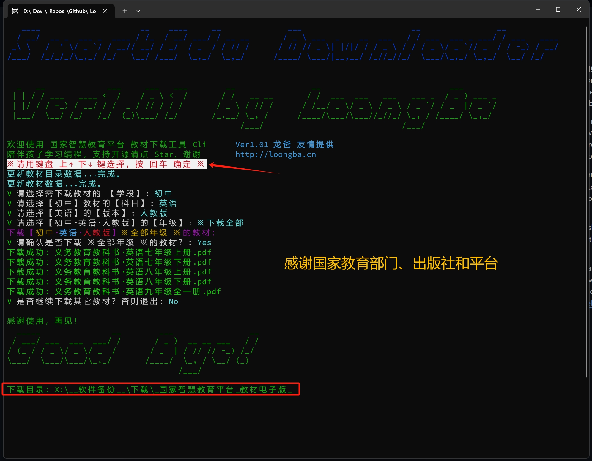
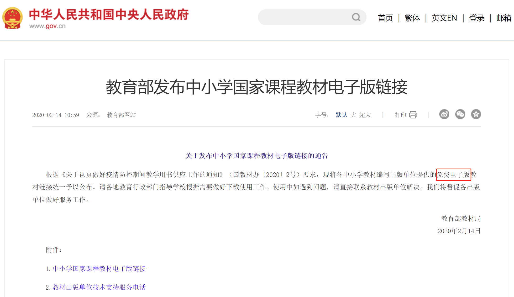

# SmartEdu Downloader Cli v1.00

# 一、中小学教材电子版下载器 极简版——命令行版本 V1.00

## 告别诱导关注，远离低质量电子版

+ **质量保证**，教材来自 <u>国家平台和各大出版社</u>，**可复制文本和图片**的**真 PDF**，不是扫描和拍照可比较；

+ **工具极简**，**最小不到 3M**（另外一个版本只有一行代码），没有复杂的要求；

+ **操作极简**，只需要键盘上下选择、回车确认，已经是我能想到最简的方式（另外有个**增强版**可下载视频，待升级）；

+ **批量下载**，偷懒的话，选择好学段、科目和版本类型，即可一次性下载所有年级；

+ **方便学习**，代码开源、免费提供，原本就是带我家小朋友学习编程的练手项目，**一起学习，共同进步**；

## 0. 项目源代码：

- Github: [GitHub - LoongBa/SmartEduDownloader: 下载 国家智慧教育平台 电子教材、视频课程的极简工具。这是一个陪孩子学编程的练习项目，将陆续练习 WinForm、WPF、MAUI 等 UI 实现方式。](https://github.com/LoongBa/SmartEduDownloader)

- Gitee：[SmartEduDownloader: 下载 国家智慧教育平台 电子教材、视频课程的极简工具。这是一个陪孩子学编程的练习项目，将陆续练习 WinForm、WPF、MAUI 等 UI 实现方式。](https://gitee.com/LoongBa/SmartEduDownloader)

## 1. 下载说明

1. **Windows 10** 的朋友请下载：
   **【独立版】** SmartEduDownloader.Cli_V1.00_Standalone_forWin10_x64.zip
   （不依赖 .NET 8 运行环境的版本，在 Windows 7 下也可以运行——我没测试环境，**欢迎反馈**）

2. **Windows 11** 的朋友可以下载更小的版本： 小于 3M
   **【最简版】** SmartEduDownloader.Cli_V1.00_Runtime_forWin11_x64.zip
   （Win11 较新版已经内置 .NET 8 运行环境）

### 1.1 运行环境的依赖情况说明

1. **【独立版】** 不需要安装 .NET 8 运行环境，但压缩包略大：9.7M 左右。 

2. **【最简版】** 需下载安装 .NET 8 运行环境，就能运行：
   
   + 访问 **微软官网** 选择下载最新版本：[https://dotnet.microsoft.com/zh-cn/download/dotnet/8.0](https://dotnet.microsoft.com/zh-cn/download/dotnet/8.0) （**右下角下载【运行时】 x64 版本，安装**）
     
     或者
   
   + 从 **微软官网** 直接下载 <u>.NET 8 runtime 8.07 x64</u>：[https://download.visualstudio.microsoft.com/download/pr/3980ab0a-379f-44a0-9be6-eaf74c07a3b3/bd1cc6107ff3d8fe0104d30f01339b74/dotnet-runtime-8.0.7-win-x64.exe](https://download.visualstudio.microsoft.com/download/pr/3980ab0a-379f-44a0-9be6-eaf74c07a3b3/bd1cc6107ff3d8fe0104d30f01339b74/dotnet-runtime-8.0.7-win-x64.exe)  

**其它系统如 macOS、32位 Windows**，我没测试过，但 **.NET 跨平台，需要的话发布时增加不同版本** 应该是很简单的。

但从下载教材的需求来说，想必不太有需求，将就解决一下吧 &#128514;  

## 2. 已知问题

1. 分别在 `CMD` 和 `Powershell` 运行时，**字符颜色不同**，影响不大，等有空再仔细检查原因；
2. **默认下载**到 “**我的下载**” 目录下的【_国家智慧教育平台_教材电子版_】目录（每个人的设置不同，工具退出前会提示并自动打开该目录），
   ——极简版的用户**自行设置目标目录**的意义不太大，故**简化之**
3. **目录结构**暂时不支持选择，默认为：学段——科目——版本（部编版等）——年级，
   ——**考虑抽空升级，允许选择不同的目录结构**，如：版本——学段——科目——年级
4. **尚未测试 .NET AOT 编译优化**，可执行文件应该还可以更小。

---

## 3. 其它项目

在孩子去年到今年学习编程过程中，针对**中小学教材电子版的下载**，另外还有两个练手版本：  

1. **极简中的极简 JS 版：** Javascript，**只需将一句 js 代码复制到浏览器地址栏**（或者 F12 开发工具的控制台），就能下载当前页面的电子教材  
   **——添加到收藏夹，非常方便  
   ——缺点是不支持一次下载多个教材**
   **Github:** [GitHub - LoongBa/SmartEduDownloaderJS: 极简一键下载【国家智慧教育平台电子教材】，无需注册、登录，无需下载安装软件和环境，粘贴一行 Javascript 即可。](https://github.com/LoongBa/SmartEduDownloaderJS)
   
   **Gitee：** [SmartEduDownloaderJS: 极简一键下载【国家智慧教育平台电子教材】，无需注册、登录，无需下载安装软件和环境，在浏览器粘贴一行 Javascript 即可。](https://gitee.com/LoongBa/SmartEduDownloaderJS)

2. **增强版**：——有极简版，暂时没发布，考虑抽空加入下载视频教程的全套素材再发布（视频、教案PPT等）  

**请教各位一个问题：有【下载视频教程】的需求么？**  
**——如果有需求，抽空加上这个功能**

---

## 4. 使用说明

> 用键盘上下键选择，
> 
> 用回车键确定，
> 
> 确认时输入“y”，
> 
> 完事。

# 二、背景信息：免费电子版教材的来源

## 1. 义务教育阶段免费提供电子版教材

**无论哪个出版社**的教材，**所有涉及九年制义务教育的教材**，按照国家《**中华人民共和国义务教育法**》之规定，

以及2020年2月14日教育部《[关于发布中小学国家课程教材电子版链接的通告](https://www.gov.cn/xinwen/2020-02/14/content_5478551.htm)》

将各中小学教材编写出版单位提供的**免费电子版教材**链接统一予以公布，才有了下载电子版教材之说。

## 2. 人教社：人民教育出版社 一直免费提供

多年以来，一直提供教材电子版下载。我一直从[人民教育出版社的官网](http://www.pep.com.cn/)下载小学课本电子版——因为没用到其它教材。

后来大概是在2022年，**数学教材问题**引发重新修改四年级以后的数学教材，人教社官网上暂时不再提供涉及调整的教材。

恢复下载后，下载地址从 [人民教育出版社官方网站－培根铸魂　启智增慧](http://bp.pep.com.cn/jc) 改为了现在可用的 [https://jc.pep.com.cn/](https://jc.pep.com.cn/) 。

## 3. 国家智慧教育平台：国家智慧教育公共服务平台、国家中小学智慧教育平台

此后，同期由**教育部教育技术与资源发展中心**（**中央电化教育馆**）主导建设维护的**国家智慧教育公共服务平台**也多次改版、完善，

收录了包括人民教育出版社在内的**多家出版单位的电子教材**，成为更完整、权威的资源平台。这里对该平台暂不展开介绍。

**国家智慧教育平台** 全称：【[国家智慧教育公共服务平台](https://www.smartedu.cn/)】。

其中，**中小学内容部分**又叫做【[国家中小学智慧教育平台](https://basic.smartedu.cn/)】。

——这是目前最全、最方便的教材下载来源。

——还有非常多不错的学习资料，是教师备课、家长战友们和孩子们学习的宝藏。

> 关于【智慧教育】这个话题，以及如何系统地理解和掌握学习的方法论，回头我再细细分享。

## 4. 推荐：人教社小程序

之所以再次提到人教社，因为从家长和学生角度，**人教社公众号和小程序更好用**——必须帮它们打个广告：

1. **方便手机、平板**等移动设备查看和使用；

2. **小程序支持点读**：语文、英语 都支持 “**指到哪里读哪里**”，妈妈再也不用担心我的学习了。

作为家长和学生，真心**感谢国家、感谢教育部、感谢相关出版机构**。

# 三、告别不良诱导和低质教材

每年假期，总有一些战友们（小朋友的父母们）给孩子提前预习下个学期的内容。

（各类培训机构、教育公众号等，都在**鼓励提前预习**——我个人持反对态度，回头单独展开说明我的考虑）

然而，很多培训机构、公众号，为了吸引流量，诱导关注后提供下载。

甚至有的战友们很辛苦的扫描、拍照等方式制作教材电子版，质量实在是难以描述。

——其实都不必，国家免费提供了！

——而且真正的 PDF，**可复制文字、图片**，不是图片扫描版！

**——再次感谢国家教育部门、出版社和平台！**

有红头文件为证：

> 2020年2月14日教育部《[关于发布中小学国家课程教材电子版链接的通告](https://www.gov.cn/xinwen/2020-02/14/content_5478551.htm)》

